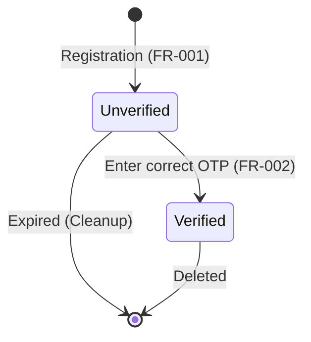
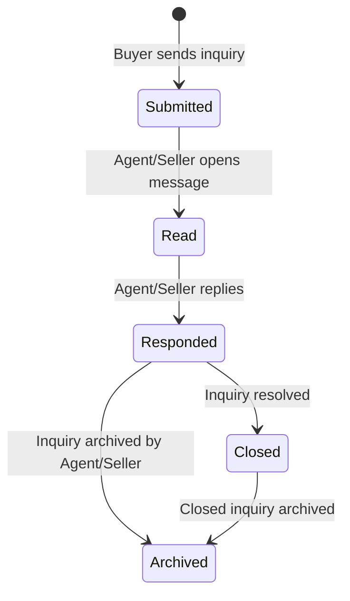

# Data Model: User Authentication & Profile Management

## Database Entities

### 1. User
Represents a user account in the system. Extends ASP.NET Core Identity's base user entity.

| Column Name | Data Type | Constraints | Description |
| :--- | :--- | :--- | :--- |
| **Id** | `UUID` | Primary Key | Unique identifier |
| **Email** | `VARCHAR(256)` | Unique, Not Null | Email address |
| **PasswordHash** | `VARCHAR(512)` | Not Null | Hashed password |
| **FirstName** | `VARCHAR(100)` | Not Null | User's first name |
| **LastName** | `VARCHAR(100)` | Not Null | User's last name |
| **PhoneNumber** | `VARCHAR(20)` | Nullable | Contact number |
| **ProfilePictureUrl** | `VARCHAR(512)` | Nullable | URL to user's photo |
| **Role** | `VARCHAR(50)` | Not Null | User role: Admin, Agent, Buyer, Seller |
| **IsVerified** | `BOOLEAN` | Default `false` | Registration verification flag |
| **CreatedAt** | `TIMESTAMP` | Default `CURRENT_TIMESTAMP` | Account creation date |
| **LastLogin** | `TIMESTAMP` | Nullable | Last login date |

### 2. UserRole
Join table for User and Role mappings (leveraging standard ASP.NET Identity).

| Column Name | Data Type | Constraints | Description |
| :--- | :--- | :--- | :--- |
| **UserId** | `UUID` | Foreign Key (User) | Matches User ID |
| **RoleId** | `VARCHAR(50)` | Foreign Key | Target Role |

### 3. PropertyFavorite
Represents a user's bookmarked property listings.

| Column Name | Data Type | Constraints | Description |
| :--- | :--- | :--- | :--- |
| **Id** | `UUID` | Primary Key | Favorite mapping ID |
| **UserId** | `UUID` | Foreign Key (User), Not Null | User bookmarking the listing |
| **PropertyId** | `UUID` | Not Null | Bookmarked Property listing ID |
| **CreatedAt** | `TIMESTAMP` | Default `CURRENT_TIMESTAMP` | Bookmark date |

*Indexes:*
- Unique Index on `(UserId, PropertyId)` to prevent duplicate favorites.

### 4. PropertyInquiry
Represents inquiries sent by users regarding property listings.

| Column Name | Data Type | Constraints | Description |
| :--- | :--- | :--- | :--- |
| **Id** | `UUID` | Primary Key | Inquiry ID |
| **BuyerId** | `UUID` | Foreign Key (User), Not Null | Buyer requesting details |
| **PropertyId** | `UUID` | Not Null | Target Property listing ID |
| **Message** | `TEXT` | Not Null | Message contents |
| **Status** | `VARCHAR(50)` | Default `'Submitted'` | Status: Submitted, Read, Responded, Closed, Archived |
| **CreatedAt** | `TIMESTAMP` | Default `CURRENT_TIMESTAMP` | Timestamp of submission |
| **LastUpdatedAt**| `TIMESTAMP` | Default `CURRENT_TIMESTAMP` | Timestamp of status change |

*Relationships:*
- User: `BuyerId` (Many-to-One)

### 5. RecentlyViewed
Represents a log of listings viewed by a user.

| Column Name | Data Type | Constraints | Description |
| :--- | :--- | :--- | :--- |
| **Id** | `UUID` | Primary Key | History log ID |
| **UserId** | `UUID` | Foreign Key (User), Not Null | User who viewed the listing |
| **PropertyId** | `UUID` | Not Null | Target Property listing ID |
| **ViewedAt** | `TIMESTAMP` | Default `CURRENT_TIMESTAMP` | Viewing timestamp |

*Indexes:*
- Index on `UserId` for fast historical retrieval.

---

## State Transition Models

### 1. Account Verification Status

### 2. Property Inquiry Lifecycle

---

## Validation Rules

- **Password Complexity**: Checked at registration (FR-001) and reset. Must be minimum 8 characters, containing at least 1 uppercase letter, 1 lowercase letter, 1 number, and 1 special character.
- **Email Validation**: Must follow standard RFC 5322 regex. Must be unique in the `User` table.
- **Property Favorites Limit**: No hard limit, but maximum property comparisons (FR-011) restricted to 4 concurrent items.
