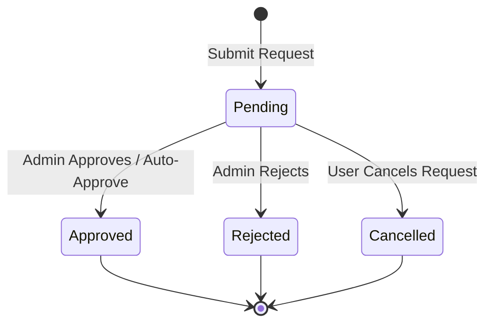

# Data Model: Multi-Role User Management

## Schema Design

### 1. `Users` Table (Modifications)
| Column Name | Data Type | Nullable | Description / Constraints |
|-------------|-----------|----------|---------------------------|
| **ActiveRoleId** | Guid | Yes | Foreign Key to `Roles`. Represents the user's selected active role. Defaults to `Buyer`'s Role ID on user creation. |

### 2. `RoleRequests` Table
| Column Name | Data Type | Nullable | Description / Constraints |
|-------------|-----------|----------|---------------------------|
| **Id** | Guid | No | Primary Key |
| **UserId** | Guid | No | Foreign Key to `Users` |
| **RequestedRoleId** | Guid | No | Foreign Key to `Roles` |
| **Status** | int | No | Enum: `0 = Pending`, `1 = Approved`, `2 = Rejected`, `3 = Cancelled` |
| **Reason** | string(500) | No | Reason for the request |
| **SubmittedAt** | DateTime | No | Timestamp of submission |
| **ReviewedBy** | Guid | Yes | Foreign Key to `Users` (Admin reviewer) |
| **ReviewedAt** | DateTime | Yes | Timestamp of admin review |
| **ReviewNotes** | string(500) | Yes | Feedback from the admin |

### 3. `RoleRequestHistory` Table
| Column Name | Data Type | Nullable | Description / Constraints |
|-------------|-----------|----------|---------------------------|
| **Id** | Guid | No | Primary Key |
| **RequestId** | Guid | No | Foreign Key to `RoleRequests` (Cascade delete on request purge) |
| **OldStatus** | int | No | Enum status before change |
| **NewStatus** | int | No | Enum status after change |
| **ChangedBy** | Guid | No | Foreign Key to `Users` |
| **ChangedAt** | DateTime | No | Timestamp |
| **Notes** | string(500) | Yes | Audit notes |

### 4. `SystemSettings` Table
| Column Name | Data Type | Nullable | Description / Constraints |
|-------------|-----------|----------|---------------------------|
| **Key** | string(100) | No | Primary Key (e.g. `AutoApproveRoleRequests`) |
| **Value** | string(500) | No | Value (e.g. `true` / `false`) |

## Lifecycle States: `RoleRequest.Status`

