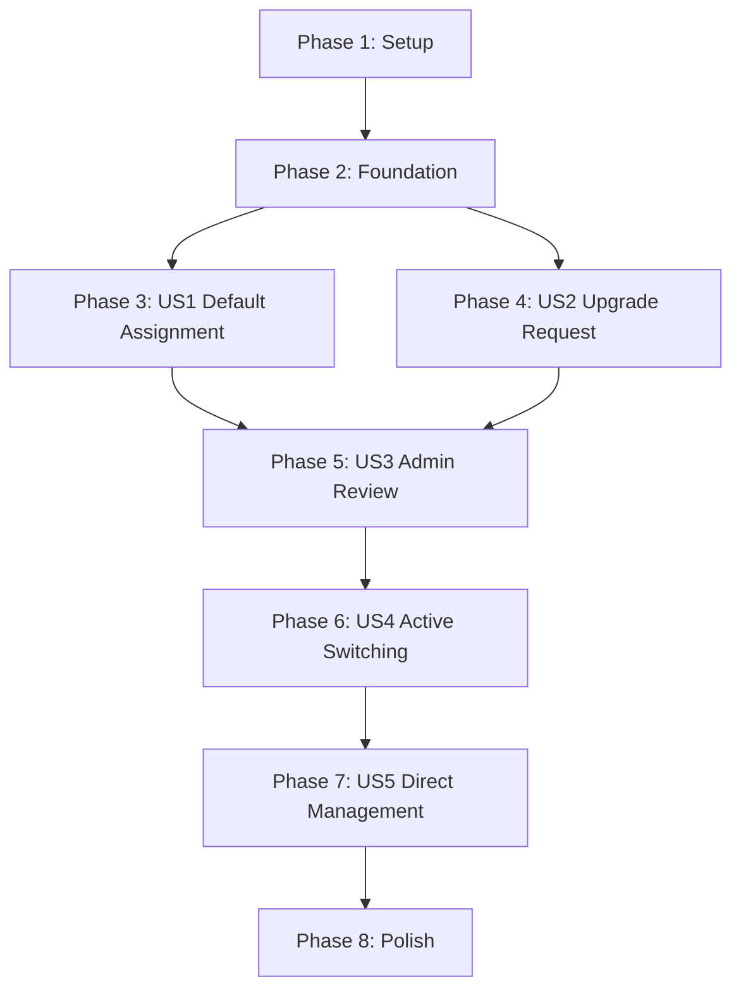

# Tasks: Multi-Role User Management and Role Upgrade Workflow

**Input**: Design documents from `/specs/004-multi-role-management/`

**Prerequisites**: [plan.md](file:///d:/Projects/Real-Estate-Project/specs/004-multi-role-management/plan.md), [spec.md](file:///d:/Projects/Real-Estate-Project/specs/004-multi-role-management/spec.md), [research.md](file:///d:/Projects/Real-Estate-Project/specs/004-multi-role-management/research.md), [data-model.md](file:///d:/Projects/Real-Estate-Project/specs/004-multi-role-management/data-model.md), [contracts/api.md](file:///d:/Projects/Real-Estate-Project/specs/004-multi-role-management/contracts/api.md)

**Tests**: Tests are requested by the project constitution (Core Principle V). Unit and integration testing tasks are included and mapped.

---

## Phase 1: Setup (Shared Infrastructure)

**Purpose**: Set up database migrations, endpoints registries, and state management frameworks.

- [x] T001 Initialize database schemas placeholder in `backend/src/API/Migrations/`
- [x] T002 Configure state management interfaces for roles in `frontend/src/services/roleApi.ts`

---

## Phase 2: Foundational (Blocking Prerequisites)

**Purpose**: Build core domain model structures and database mappings that all stories require.

**⚠️ CRITICAL**: Setup and Foundational phases must be completed before starting any user story tasks.

- [x] T003 [P] Create Domain entities `RoleRequest`, `RoleRequestHistory`, `SystemSetting` in `backend/src/Domain/Entities/`
- [x] T004 Create Domain event definitions `RoleRequested`, `RoleApproved`, `RoleRejected`, `RoleAssigned`, `RoleRemoved`, `ActiveRoleChanged` in `backend/src/Domain/Events/`
- [x] T005 Update DbContext configuration and mappings in `backend/src/Infrastructure/Persistence/ApplicationDbContext.cs` and generate the EF Core migration
- [x] T006 [P] Execute database update to apply role tables on database environment

**Checkpoint**: Foundation ready - user story implementation can begin.

---

## Phase 3: User Story 1 - Default Role Assignment on Registration (Priority: P1) 🎯 MVP

**Goal**: Automatically assign the "Buyer" role to all newly registered users.

**Independent Test**: Register a new user, inspect database records, verify the `Buyer` role is present.

### Tests for User Story 1
- [x] T007 [P] [US1] Write unit tests for user registration default role assignment in `backend/tests/Application.UnitTests/Auth/Commands/RegisterUserTests.cs`

### Implementation for User Story 1
- [x] T008 [US1] Update user registration handler to automatically assign the "Buyer" role in `backend/src/Application/Auth/Commands/RegisterUserCommand.cs`
- [x] T009 [US1] Update initial profile creation to set `ActiveRoleId` to the Buyer's role ID in the database user record

**Checkpoint**: User Story 1 functional; new users are assigned Buyer role by default.

---

## Phase 4: User Story 2 - Role Upgrade Request and Workflow (Priority: P1) 🎯 MVP

**Goal**: Allow Buyer users to submit role requests for Seller or Agent roles.

**Independent Test**: Submit a role request from the profile page; verify request creation or immediate auto-approval.

### Tests for User Story 2
- [x] T010 [P] [US2] Write unit tests for request creation logic in `backend/tests/Application.UnitTests/Roles/Commands/CreateRoleRequestTests.cs`
- [x] T011 [P] [US2] Write component tests for profile upgrades flow in `frontend/tests/pages/Profile/ProfilePage.test.tsx`

### Implementation for User Story 2
- [x] T012 [US2] Implement `CreateRoleRequestCommand` checking for existing duplicate requests in `backend/src/Application/Roles/Commands/CreateRoleRequestCommand.cs`
- [x] T013 [US2] Add FluentValidation check validating requested role type constraints in `backend/src/Application/Roles/Commands/CreateRoleRequestCommandValidator.cs`
- [x] T014 [US2] Add upgrade endpoints to user controller in `backend/src/API/Controllers/UserRolesController.cs`
- [x] T015 [US2] Implement "Become Seller/Agent" buttons, reason textareas, and current status display in `frontend/src/pages/Profile/ProfilePage.tsx`

**Checkpoint**: User Story 2 complete; users can request upgrades and see status states.

---

## Phase 5: User Story 3 - Admin Role Request Moderation (Priority: P2)

**Goal**: Allow admins to approve or reject pending role requests.

**Independent Test**: Admin approves/rejects a pending request; request status updates and roles are assigned.

### Tests for User Story 3
- [x] T016 [P] [US3] Write unit tests for Approve/Reject requests command in `backend/tests/Application.UnitTests/Roles/Commands/ReviewRoleRequestTests.cs`
- [x] T017 [P] [US3] Write component tests for Admin moderation UI in `frontend/tests/pages/Admin/AdminRoleRequestsPage.test.tsx`

### Implementation for User Story 3
- [x] T018 [US3] Implement `GetRoleRequestsQuery` query handler returning paginated, filtered requests in `backend/src/Application/Roles/Queries/GetRoleRequestsQuery.cs`
- [x] T019 [US3] Implement `ApproveRoleRequestCommand` handler assigning role and emitting `RoleApproved` event in `backend/src/Application/Roles/Commands/ApproveRoleRequestCommand.cs`
- [x] T020 [US3] Implement `RejectRoleRequestCommand` handler logging review comments in `backend/src/Application/Roles/Commands/RejectRoleRequestCommand.cs`
- [x] T021 [US3] Add Admin approve/reject controller actions in `backend/src/API/Controllers/UserRolesController.cs`
- [x] T022 [US3] Build admin moderation page at `frontend/src/pages/Admin/AdminRoleRequestsPage.tsx` supporting review details, custom popups/modals, and action commits

**Checkpoint**: User Story 3 complete; manual review workflow behaves correctly.

---

## Phase 6: User Story 4 - Session Active Role Switching (Priority: P2)

**Goal**: Allow multi-role users to toggle their active session role.

**Independent Test**: Toggle role in profile; verify UI/navigation layout switches while retaining all capabilities.

### Tests for User Story 4
- [x] T023 [P] [US4] Write unit tests for active role switching and claims aggregation in `backend/tests/Application.UnitTests/Roles/Commands/SwitchActiveRoleTests.cs`

### Implementation for User Story 4
- [x] T024 [US4] Implement `SwitchActiveRoleCommand` updating active role database value in `backend/src/Application/Roles/Commands/SwitchActiveRoleCommand.cs`
- [x] T025 [US4] Update JWT claim generation pipeline to aggregate and map all user permissions in `backend/src/Infrastructure/Identity/IdentityService.cs`
- [x] T026 [US4] Add switch endpoint handler in `backend/src/API/Controllers/UserRolesController.cs`
- [x] T027 [US4] Integrate active role switcher in user dropdown and condition default navigation targets in `frontend/src/components/Layout/AppLayout.tsx`

**Checkpoint**: User Story 4 complete; users can switch UI context easily.

---

## Phase 7: User Story 5 - Admin User Management Controls (Priority: P3)

**Goal**: Allow admins to edit user roles directly from user profile details.

**Independent Test**: Admin directly assigns/removes roles; user profile updates.

### Tests for User Story 5
- [x] T028 [P] [US5] Write unit tests for direct role assignment validation in `backend/tests/Application.UnitTests/Admin/Users/Commands/UpdateUserRolesTests.cs`

### Implementation for User Story 5
- [x] T029 [US5] Implement `UpdateUserRolesCommand` preventing self-demotion lockout of Admin roles in `backend/src/Application/Admin/Users/Commands/UpdateUserRolesCommand.cs`
- [x] T030 [US5] Add user roles modification endpoint in `backend/src/API/Controllers/AdminUsersController.cs`
- [x] T031 [US5] Update user profile editor to add roles list checklist and disable toggle switches in `frontend/src/pages/Admin/UserManagementPage.tsx`

**Checkpoint**: User Story 5 complete; admin has administrative controls.

---

## Phase 8: Polish & Cross-Cutting Concerns

**Purpose**: General optimizations, document adjustments, and validation checks.

- [x] T032 Build auto-approval toggle switch on platform settings for Admins at `frontend/src/pages/Admin/AdminSettingsPage.tsx`
- [x] T033 Verify backend API formatting (`dotnet format`) and frontend lint check (`npm run lint`)
- [x] T034 Run end-to-end verification scenarios mapped in `specs/004-multi-role-management/quickstart.md`

---

## Dependencies & Execution Order

### Phase Dependencies
- **Setup (Phase 1) & Foundational (Phase 2)**: Core blocking prerequisites.
- **User Stories (Phases 3-7)**: Mapped sequentially from MVP (Default assignment & Upgrade request) to moderation, switching, and user settings.
- **Polish (Phase 8)**: Depends on all user stories being complete.

### Parallel Opportunities
- Task T003 (Domain entities) and T004 (Domain events) can be written in parallel.
- Frontend component tests (T011) and backend unit tests (T010) can proceed in parallel.
- Once Foundation is complete, different developers can start on US1 (Default Role) and US2 (Upgrade Request) in parallel.
