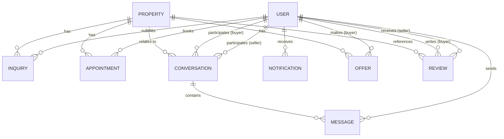

# Data Model Specification: Buyer & Seller Communication Platform

## 1. Entities & Relationships

---

## 2. Table Schemas (EF Core Configuration)

### A. Inquiry Table (`Inquiries`)
Stores prospective buyer inquiries for properties.

| Column | Type | Nullability | Constraints / Keys | Description |
|---|---|---|---|---|
| `Id` | `Guid` | NOT NULL | Primary Key | Unique inquiry identifier |
| `PropertyId` | `Guid` | NOT NULL | Foreign Key -> `Properties.Id` | Target property listing |
| `BuyerId` | `Guid` | NOT NULL | Foreign Key -> `AspNetUsers.Id` | User making the inquiry |
| `Subject` | `NVarChar(200)` | NOT NULL | Length: 5-200 | Subject title |
| `Message` | `NVarChar(2000)` | NOT NULL | Length: 10-2000 | Body content |
| `Phone` | `VarChar(20)` | NOT NULL | regex validation | Contact number |
| `Email` | `VarChar(256)` | NOT NULL | email validation | Contact email |
| `PreferredContactMethod`| `Int` | NOT NULL | Enum: Phone, Email, Chat | Selection |
| `PreferredContactTime`  | `NVarChar(100)` | NOT NULL | Length: max 100 | e.g. "Afternoons" |
| `Status` | `Int` | NOT NULL | Enum | New (0), Read (1), Replied (2), In Progress (3), Closed (4), Cancelled (5) |
| `CreatedAt` | `DateTimeOffset` | NOT NULL | Default: GetUtcDate() | Date created |
| `IsDeleted` | `Bit` | NOT NULL | Default: 0 | Soft-delete status |

*   **Indexes**:
    *   Index on `(BuyerId, IsDeleted)` (for buyer inquiry history)
    *   Index on `(PropertyId, IsDeleted)` (for owner property inquires view)

---

### B. Appointment Table (`Appointments`)
Manages visit requests and scheduling.

| Column | Type | Nullability | Constraints / Keys | Description |
|---|---|---|---|---|
| `Id` | `Guid` | NOT NULL | Primary Key | Unique appointment identifier |
| `PropertyId` | `Guid` | NOT NULL | Foreign Key -> `Properties.Id` | Target property listing |
| `BuyerId` | `Guid` | NOT NULL | Foreign Key -> `AspNetUsers.Id` | Scheduling buyer |
| `Date` | `DateOnly` | NOT NULL | Must be in future | Visit date |
| `Time` | `TimeOnly` | NOT NULL | Time range validation | Visit start time |
| `Message` | `NVarChar(1000)` | NULL | Length: max 1000 | Custom notes / details |
| `VisitorCount` | `Int` | NOT NULL | Range: 1 - 20 | Number of prospective visitors |
| `Status` | `Int` | NOT NULL | Enum | Pending (0), Approved (1), Rejected (2), Rescheduled (3), Completed (4), Cancelled (5) |
| `CreatedAt` | `DateTimeOffset` | NOT NULL | Default: GetUtcDate() | Booking timestamp |
| `UpdatedAt` | `DateTimeOffset` | NULL | | Update timestamp |

*   **Indexes**:
    *   Index on `(BuyerId, PropertyId, Status)` where `Status = 0` (Pending) - enforces unique active pending appointment constraint.
    *   Index on `(PropertyId, Date)` - helps check for booking overlaps.

---

### C. Conversation Table (`Conversations`)
Represents the chat channel between a buyer and seller/agent for a specific listing.

| Column | Type | Nullability | Constraints / Keys | Description |
|---|---|---|---|---|
| `Id` | `Guid` | NOT NULL | Primary Key | Unique conversation identifier |
| `PropertyId` | `Guid` | NOT NULL | Foreign Key -> `Properties.Id` | Associated property |
| `BuyerId` | `Guid` | NOT NULL | Foreign Key -> `AspNetUsers.Id` | Chat initiator |
| `SellerId` | `Guid` | NOT NULL | Foreign Key -> `AspNetUsers.Id` | Listing owner / agent |
| `CreatedAt` | `DateTimeOffset` | NOT NULL | Default: GetUtcDate() | Creation timestamp |
| `LastMessageAt` | `DateTimeOffset` | NOT NULL | Default: GetUtcDate() | For pagination ordering |
| `IsDeletedByBuyer` | `Bit` | NOT NULL | Default: 0 | Soft-delete status for buyer |
| `IsDeletedBySeller` | `Bit` | NOT NULL | Default: 0 | Soft-delete status for seller |

*   **Indexes & Constraints**:
    *   Unique constraint on `(BuyerId, PropertyId)` - prevents duplicate active conversations for the same buyer-property combination.
    *   Index on `(BuyerId, LastMessageAt, IsDeletedByBuyer)` and `(SellerId, LastMessageAt, IsDeletedBySeller)` (for sorting conversation lists).

---

### D. Message Table (`Messages`)
Stores individual exchanges in a conversation.

| Column | Type | Nullability | Constraints / Keys | Description |
|---|---|---|---|---|
| `Id` | `Guid` | NOT NULL | Primary Key | Unique message identifier |
| `ConversationId`| `Guid` | NOT NULL | Foreign Key -> `Conversations.Id` | Owner conversation |
| `SenderId` | `Guid` | NOT NULL | Foreign Key -> `AspNetUsers.Id` | Message sender |
| `Content` | `NVarChar(MAX)` | NOT NULL | Length: 1 - 4000 (text) | Text or JSON payload for offers |
| `ContentType` | `Int` | NOT NULL | Enum: Text (0), Image (1), File (2), OfferCard (3) | Message data type |
| `IsRead` | `Bit` | NOT NULL | Default: 0 | Read receipt status |
| `IsDelivered` | `Bit` | NOT NULL | Default: 1 | Delivered status |
| `CreatedAt` | `DateTimeOffset` | NOT NULL | Default: GetUtcDate() | Sending timestamp |

*   **Indexes**:
    *   Index on `(ConversationId, CreatedAt DESC)` - optimizes chat message loading.

---

### E. Notification Table (`Notifications`)
Manages live in-app notifications.

| Column | Type | Nullability | Constraints / Keys | Description |
|---|---|---|---|---|
| `Id` | `Guid` | NOT NULL | Primary Key | Unique notification identifier |
| `RecipientId` | `Guid` | NOT NULL | Foreign Key -> `AspNetUsers.Id` | Alert recipient |
| `Type` | `Int` | NOT NULL | Enum | Inquiry (0), Appointment (1), Message (2), Offer (3), Review (4) |
| `Content` | `NVarChar(500)` | NOT NULL | Length: 5 - 500 | Human-readable alert text |
| `IsRead` | `Bit` | NOT NULL | Default: 0 | View status |
| `CreatedAt` | `DateTimeOffset` | NOT NULL | Default: GetUtcDate() | Alert timestamp |

*   **Indexes**:
    *   Index on `(RecipientId, IsRead DESC, CreatedAt DESC)` - optimizes notifications query and unread count aggregation.

---

### F. Offer Table (`Offers`)
Coordinates price negotiations.

| Column | Type | Nullability | Constraints / Keys | Description |
|---|---|---|---|---|
| `Id` | `Guid` | NOT NULL | Primary Key | Unique offer identifier |
| `PropertyId` | `Guid` | NOT NULL | Foreign Key -> `Properties.Id` | Property under negotiation |
| `BuyerId` | `Guid` | NOT NULL | Foreign Key -> `AspNetUsers.Id` | Buyer submitting the offer |
| `OfferAmount` | `Decimal(18,2)`| NOT NULL | Must be > 0 | Financial amount |
| `Message` | `NVarChar(1000)` | NULL | Length: max 1000 | Negotiation notes |
| `ExpirationDate`| `DateTimeOffset`| NOT NULL | Must be in future | Validity deadline |
| `Status` | `Int` | NOT NULL | Enum | Pending (0), Accepted (1), Rejected (2), Countered (3), Expired (4), Cancelled (5) |
| `CreatedAt` | `DateTimeOffset` | NOT NULL | Default: GetUtcDate() | Offer submission time |

*   **Indexes**:
    *   Index on `(BuyerId, PropertyId, Status)` where `Status = 0` (Pending) - enforces single pending active offer constraint.

---

### G. Review Table (`Reviews`)
Gathers post-visit feedback.

| Column | Type | Nullability | Constraints / Keys | Description |
|---|---|---|---|---|
| `Id` | `Guid` | NOT NULL | Primary Key | Unique review identifier |
| `PropertyId` | `Guid` | NOT NULL | Foreign Key -> `Properties.Id` | Target property reference |
| `BuyerId` | `Guid` | NOT NULL | Foreign Key -> `AspNetUsers.Id` | Reviewing buyer |
| `SellerId` | `Guid` | NOT NULL | Foreign Key -> `AspNetUsers.Id` | Target seller/agent |
| `Rating` | `Int` | NOT NULL | Range: 1 - 5 | Star score |
| `Title` | `NVarChar(200)` | NOT NULL | Length: 3 - 200 | Review subject title |
| `Comment` | `NVarChar(2000)` | NOT NULL | Length: 10 - 2000 | Feedback body |
| `Images` | `NVarChar(MAX)` | NULL | JSON string array of URLs | Optional photo uploads |
| `ReplyContent` | `NVarChar(2000)` | NULL | Length: max 2000 | Seller's reply body |
| `IsReported` | `Bit` | NOT NULL | Default: 0 | Reported status |
| `IsHidden` | `Bit` | NOT NULL | Default: 0 | Hidden by admin status |
| `CreatedAt` | `DateTimeOffset` | NOT NULL | Default: GetUtcDate() | Review timestamp |

*   **Indexes**:
    *   Index on `(SellerId, IsHidden)` - for loading public profile rating widgets.
    *   Index on `(PropertyId, IsHidden)` - for listing page ratings.
