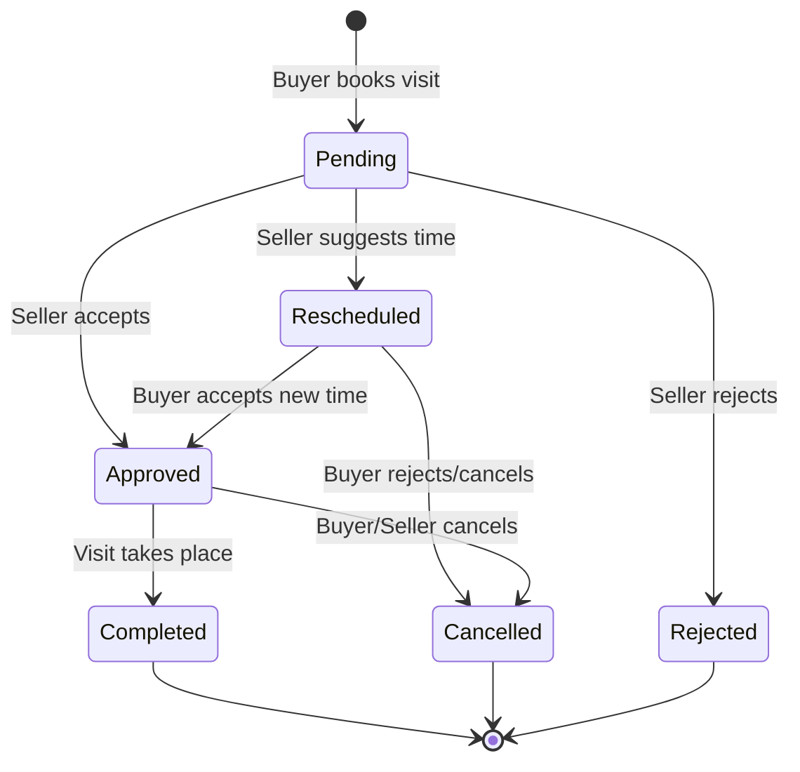
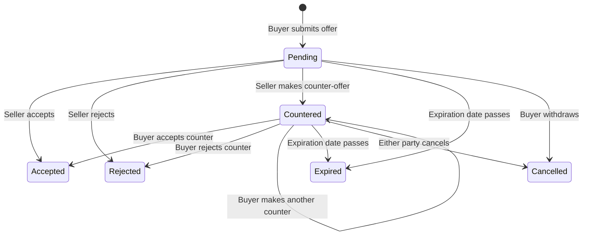

# Research & Technical Decisions: Buyer & Seller Communication Platform

## 1. Real-Time Chat & Notification Delivery (SignalR)

*   **Decision**: Use ASP.NET Core SignalR with a single unified connection or separate Hubs (`ChatHub` and `NotificationHub`). SignalR handles WebSocket negotiation, group membership, automatic reconnection, and fallback transports (Server-Sent Events, Long Polling).
*   **Rationale**:
    *   SignalR integrates natively with ASP.NET Core Identity/JWT authentication via connection tokens.
    *   Simplifies broadcasting typing indicators, read receipts, and system notifications without custom TCP/WebSocket socket management.
*   **Alternatives Considered**:
    *   *Socket.io / Node.js Sidecar*: Rejected as it introduces a second runtime stack, complicating database access and deployment.
    *   *Polling (REST)*: Rejected due to high server overhead and latency, failing SC-002 (<1.5s propagation).

---

## 2. State Lifecycles and Transitions

### A. Appointment Status State Machine

*   **Invariants**:
    *   Appointments cannot be booked in the past.
    *   Only one pending appointment can exist between a buyer and a property at any time.

### B. Offer & Negotiation State Machine

*   **Invariants**:
    *   Offer amount must be positive (> 0).
    *   Expiration date must be in the future.
    *   Only one active pending/countered negotiation can exist between a buyer and a property.

---

## 3. Offer & Negotiation UI Integration (Hybrid Approach)

*   **Decision**: Offers are officially created, edited, and negotiated via a structured Negotiation Dashboard. However, each negotiation action (creation, counter, accept, reject) automatically dispatches a system-generated message to the related SignalR `ChatHub` channel. The message contains structured metadata (JSON payload) that the frontend renders as an interactive card directly in the chat window.
*   **Rationale**:
    *   Keeps core data models distinct (Offers are domain aggregates, Messages are chat timeline records).
    *   Ensures that both users see the full context of negotiation history directly in their conversational stream, maximizing UX usability.
*   **Alternatives Considered**:
    *   *Purely in Chat*: Reject because validating state machine transitions (e.g. tracking who countered what amount) directly from raw chat message logs is error-prone.
    *   *Purely in Dashboard*: Reject because users would have to constantly toggle between chat and dashboard screens, creating fragmented UX.

---

## 4. Review Eligibility and Target Mapping

*   **Decision**: Reviews target the Seller/Agent public profile directly but MUST include a foreign key reference to the Property listing they visited. Verification logic restricts review submissions to users who have a completed `Appointment` (state = `Completed`) or completed sale transaction linked to that property/seller.
*   **Rationale**:
    *   Ensures review validity and prevents fake feedback (spam control).
    *   Enables reviews to be displayed both on the Seller/Agent profile page (aggregate trust) and on the Property details page (specific feedback).
*   **Alternatives Considered**:
    *   *Property-only reviews*: Rejected because buyer-seller trust is personal, and ratings belong to the service provider (agent/owner) rather than the physical structure.
    *   *Unverified reviews*: Rejected because it allows competitors or random guests to leave malicious reviews.
